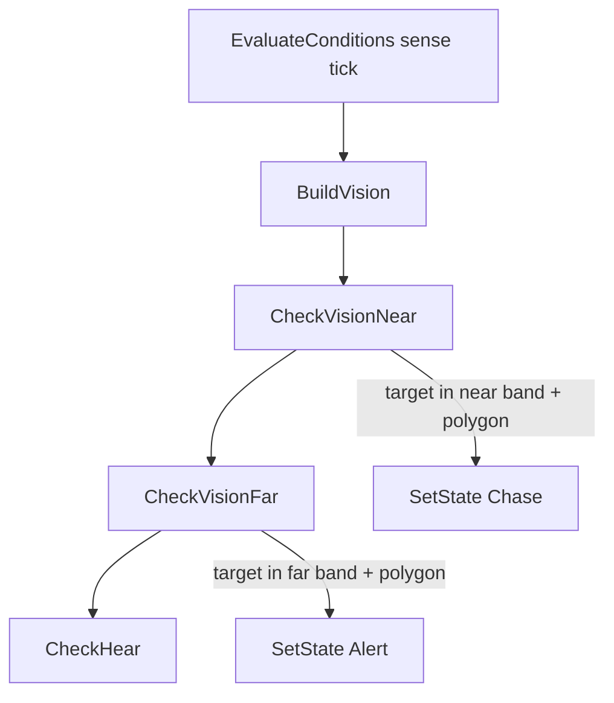

# Vision Check — Feature Spec

## 1) Purpose

Define how the tiger determines whether a unit is **visible** (line-of-sight + field of view), separate from **hearing**. This spec describes the current prototype implementation: visibility polygon + point-in-polygon test, integrated with the tiger FSM.

**Related milestones:** [M1 — Core Prototype](../milestones/m1-core-prototype-spec.md) (tiger FSM + vision/hearing), [M2 — Interaction Complete](../milestones/m2-interaction-complete-spec.md) (sleeping / low alert, Alert before Chase).

**Implementation reference (Unity repo):** `TigerUnit.cs`, `VisibilityComputer`, `PolygonUtil`, `TargetingUtils`, `GameDefines`.

## 2) Scope

| In scope | Out of scope |
|----------|----------------|
| Tiger vision polygon build (`BuildVision`) | Buffalo vision (grid-based; separate if documented later) |
| Far / near detection bands | Final art-accurate eye height or head bone |
| Occlusion from cliff tiles and rocks | Dynamic occluders other than `RockObject` |
| FSM outcomes: `Alert` (far), `Chase` (near) | Physics ray-per-target cone (legacy approach; removed) |
| Debug draw of vision wedge | Production UI telegraph |

## 3) Coordinate model

- Gameplay plane: **XZ** (top-down). Vision math uses `Vector2(x, z)`.
- **Observer origin** for polygon computation: tile-centered grid snap of the tiger position:

  `rx = floor(tiger.x / tileSize) * tileSize + tileSize/2` (same for `z` → `ry`).

- **Overlap / distance queries** use the tiger **world transform** at `y = 0.5` (probe height), not the snapped origin. Far/near radii are measured from this point.

## 4) Configuration

Constants in `GameDefines` (tunable for eval loop):

| Constant | Value | Role |
|----------|-------|------|
| `TigerSenseInterval` | 0.1 s | How often sense logic runs |
| `TigerVisionFar` | 16 | Max distance for far band + polygon build radius basis |
| `TigerVisionNear` | 8 | Max distance for near band |
| `TigerVisionAngle` | 90° | Full horizontal FOV cone |
| `TigerAlertDuration` | 1 s | Pause in `Alert` after far detection before Chase |

Occluder search uses `MapConfig.TileSize` for cliff tiles. Rocks use a square occluder (width 2 for `RockObject`, 0.5 otherwise).

## 5) Pipeline overview

Each sense tick (when not `Sleeping` / not blocked by `WakeUp`), vision runs in order:

### 5.1 Build vision polygon (`BuildVision`)

1. **Collect static occluders:** Scan grid cells within `visionR = TigerVisionFar + TileSize` of the snapped origin; add `TileKind.Cliff` as square occluders centered on each tile.
2. **Collect dynamic occluders:** `OverlapSphere` at tiger probe for entities where `CanBlockVision` → currently `RockObject` only; register as square occluders at their XZ position.
3. **Compute visibility mesh:** `VisibilityComputer(origin2D, maxDistance)` angular sweep → polygon `waypoints` (Red Blob Games–style visibility).
4. **Clip to FOV:** Cast boundary rays along `transform.forward ± halfFov`; intersect with `waypoints` via `PolygonUtil.IntersectLineWithPolygon` → `rightPoint`, `leftPoint`.
5. **Assemble `_visionPoints`:** Origin → right FOV edge → visible waypoints inside FOV (angular order) → left FOV edge.
6. **Flatten to `_visionPolygon`:** List of `Vector2` used for hit tests.

The polygon encodes **occlusion and FOV** in one shape. Far/near **range** is applied later, not by building two polygons.

### 5.2 Detect targets (`CheckVisionNear` / `CheckVisionFar`)

Two-stage filter per band:

| Stage | Mechanism | Purpose |
|-------|-----------|---------|
| 1 — Range | `TargetingUtils.FindNearestTarget` + `Physics.OverlapSphere` at tiger probe, radius `TigerVisionNear` or `TigerVisionFar` | Cheap cull by distance |
| 2 — Visibility | `PolygonUtil.IsPointInPolygon(target.xz, _visionPolygon)` | Target must lie inside the clipped visibility polygon |

**Valid targets** (`IsValidTarget`): `PlayerUnit`, `BuffaloUnit`, idle `BaitObject`.

**Skip conditions:** `TigerState.Consume`; empty polygon (`Count < 2`); existing `_target` (no steal from another sense path in the same tick after near sets target).

| Band | Range constant | FSM transition |
|------|----------------|----------------|
| Near | `TigerVisionNear` | `Chase` immediately |
| Far | `TigerVisionFar` | `Alert` (1 s face target, then `Chase` if still valid) |

Near is evaluated **before** far so close threats chase without waiting for alert.

### 5.3 Target retention

While `_target` is set, `EvaluateConditions` updates `_targetPosition` until horizontal distance exceeds `TigerVisionFar`, then clears target:

- From `Alert` → `Patrol`
- Otherwise → `Investigate`

## 6) FSM interaction

| Tiger state | Vision |
|-------------|--------|
| `Sleeping` | **Off** — only `CheckHear` each sense tick |
| `WakeUp` | Sense evaluation skipped entirely |
| `Consume` | `CheckVisionNear` / `CheckVisionFar` return early |
| `Patrol`, `Alert`, `Investigate`, `Chase` | Full pipeline (build + near + far) |

Hearing runs after vision on the same tick (unless `_target` already set by near vision).

## 7) Debug visualization

`DrawVision` (ALINE / Drawing) each frame when in state:

- Cyan wedge: far radius (`TigerVisionFar`) — polygon edges truncated from tiger XZ origin.
- Green wedge: near radius (`TigerVisionNear`) — same polygon, shorter truncate.
- Blue circle: hear range (`TigerHearRange` × multiplier).

Debug origin for wedges uses `transform.position` XZ; polygon math origin uses snapped grid center (may differ slightly at tile edges).

## 8) Key modules

| Module | Responsibility |
|--------|----------------|
| `VisibilityComputer` | Occluder segments + angular sweep → visibility polygon |
| `PolygonUtil.IsPointInPolygon` | Ray-casting point test on XZ polygon |
| `PolygonUtil.IntersectLineWithPolygon` | FOV boundary clipping |
| `TargetingUtils.FindNearestTarget` | Nearest collider in layer mask passing filter |
| `TargetingUtils.FindAllTargetsNonAlloc` | Rock discovery for occluders |

## 9) Design notes and limitations

- **Prototype fidelity:** Correct “blocked by cliff/rock + inside cone” behavior is prioritized over mesh-accurate silhouettes or per-limb visibility.
- **Target position:** Uses entity transform pivot on XZ, not collider bounds — large units may feel slightly early/late at edges.
- **Single polygon per tick:** Far and near share the same occlusion/FOV shape; only the distance threshold differs.
- **No vision during sleep:** Matches M2 low-alert setup; wake transitions use hearing or post-wake sense ticks.
- **Legacy approach:** Multi-ray `Physics.Raycast` cone scans were replaced by polygon + point-in-polygon for consistent occlusion with debug mesh.

## 10) Acceptance checks (manual / play mode)

- Player or buffalo behind a **cliff** tile edge in FOV → not detected.
- Target behind a **rock** occluder → not detected.
- Target in cone, no blocker, within **near** range → `Chase` on next sense tick.
- Target only in **far** range → `Alert` ~1 s, then `Chase` if still visible and in range.
- Tiger **sleeping** → no vision reaction; loud enough sound → investigate/wake per hearing rules.
- Moving tiger updates wedge and detection as occluders enter/leave the swept area.

## 11) Future extensions (not implemented)

- Config-driven FOV/range per map phase or difficulty.
- Additional occluder types (trees, structures).
- Separate near/far polygons or distance falloff inside one polygon.
- Automated eval scripts counting false positive/negative detection cases.
